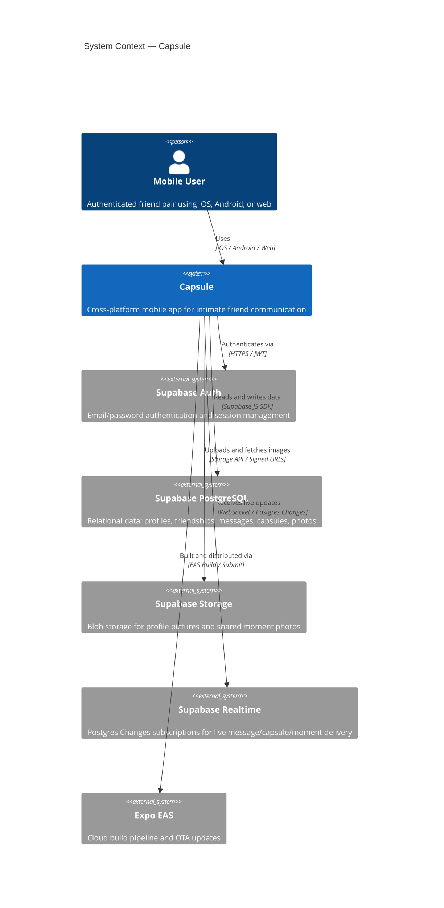
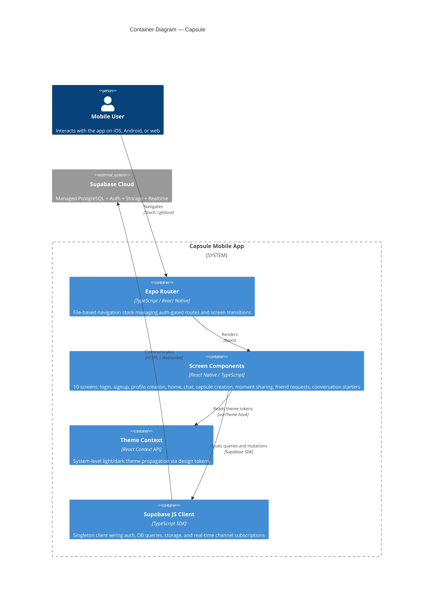
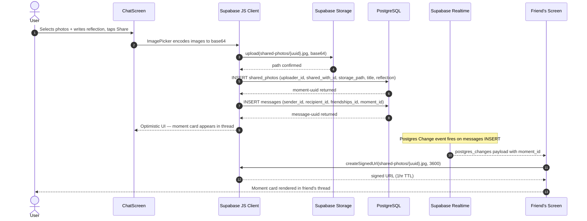
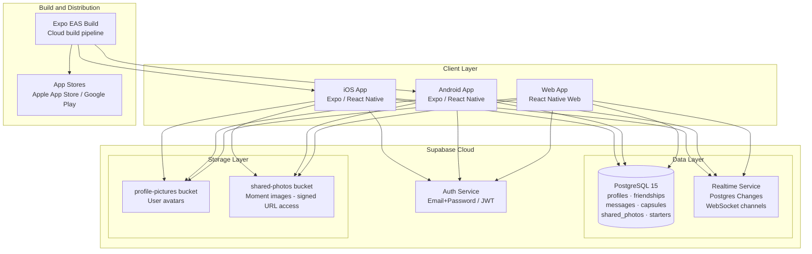
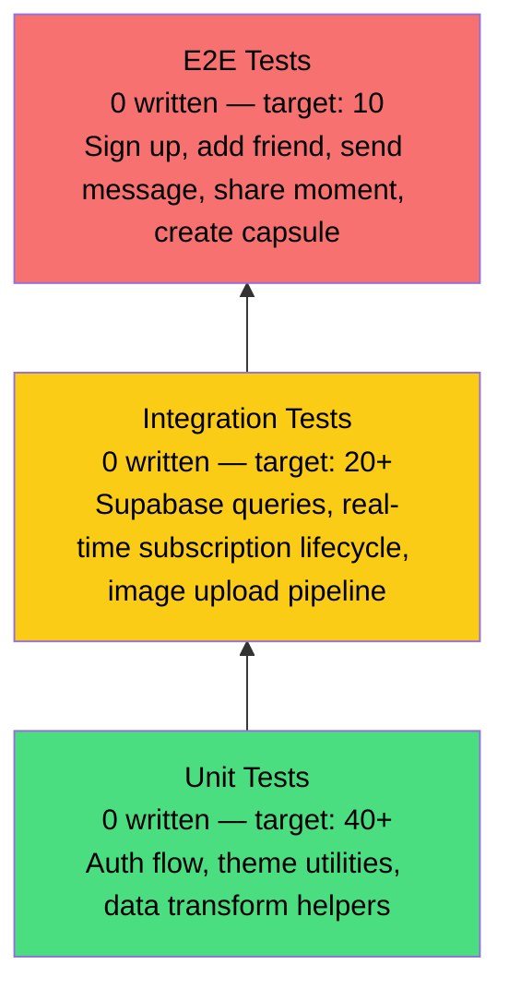

<div align="center">

# Capsule

> Intimate social mobile app that turns everyday moments and conversations into lasting memory capsules for close friends.

[](LICENSE)
[](https://github.com/thbueno/capsule/commits/master)
[](https://expo.dev)
[](https://reactnative.dev)
[](https://www.typescriptlang.org)
[](https://supabase.com)

[Report Bug](https://github.com/thbueno/capsule/issues) · [Request Feature](https://github.com/thbueno/capsule/issues)

</div>

---

## Overview

Most messaging apps optimise for volume and speed — a stream of ephemeral notifications that gets skimmed and forgotten. The result is that even close friends accumulate years of conversation history they never revisit, and meaningful exchanges disappear into an undifferentiated scroll.

Capsule is a mobile-first social platform built for **depth over breadth**. It limits the social graph to confirmed friends and introduces three distinct communication primitives: **text messages** for everyday back-and-forth, **moments** for sharing photo memories with a short reflection, and **capsules** — named, typed containers that group related messages and media into a persistent, revisitable thread (recipes shared between cooking partners, travel plans, a running list of book recommendations). Conversation starters surface prompts across six emotional categories to help friends move past "hey, what's up?" when they don't know where to begin.

### What this is NOT

- Not a broadcast social network — there are no followers, feeds, or public profiles. Every interaction is 1-to-1.
- Not a group chat app — capsules are friendship-scoped, not multi-party rooms. See [ADR-004](#adr-004-1-to-1-friendship-scope-no-group-chats) for the reasoning.
- Not a photo-sharing platform — moments are secondary artifacts attached to a relationship, not the primary content unit.
- Not designed for high-frequency ephemeral communication — for that, use iMessage or WhatsApp.

**Current state:** Prototype / take-home assessment maturity. Core flows (auth, friendship, messaging, moments, capsules) are functional end-to-end on iOS, Android, and web. No CI pipeline, no automated tests, and no production deployment exist yet.

---

## Architecture

### System Context

> Who uses this system and what external systems does it depend on?



### Container Diagram

> The independently deployable units and their communication patterns.



### Key Data Flow: Sending a Message with a Moment

> End-to-end trace of the most common rich interaction in the app.



### Infrastructure

> Supabase-hosted services backing the app. No custom server infrastructure exists at prototype stage.



### Architecture Principles

These principles shaped every structural decision in this system:

| Principle | Application |
|---|---|
| **BaaS-first, zero custom servers** | Supabase handles auth, database, storage, and real-time. There is no backend service to build, host, or maintain. All access control lives in PostgreSQL Row Level Security policies. |
| **One codebase, three platforms** | Expo / React Native delivers iOS, Android, and web from a single TypeScript codebase. Platform-specific branches (`Platform.OS`) are used only where native behaviour genuinely diverges. |
| **File-system is the router** | Expo Router maps the `/app` directory directly to navigation routes, eliminating manual route registration and providing compile-time typed route references. |
| **Design tokens before components** | All visual decisions (colour, spacing, radius, shadow) are centralised in `theme/index.ts` and consumed via `useTheme`. No magic numbers or inline hex values exist in screen files. |
| **Real-time by subscription, not polling** | Live updates (messages, capsule activity, moments) are delivered via Supabase Postgres Changes WebSocket channels. No interval-based polling exists anywhere in the client. |
| **Friendships as the trust boundary** | Every data access (messages, capsules, moments) is scoped to an accepted `friendships` record. The UI and RLS policies both enforce this — neither alone is sufficient. |

---

## Tech Stack

| Layer | Technology | Version | Rationale |
|---|---|---|---|
| **Mobile Framework** | React Native | 0.81.4 | Native rendering on iOS and Android from a single TypeScript codebase; New Architecture (JSI) enabled for better bridge performance |
| **App Platform** | Expo | 54.0.1 | Managed workflow removes native toolchain complexity per developer; EAS handles cloud builds and OTA updates without requiring Xcode/Android Studio locally |
| **Language** | TypeScript | 5.8.3 | End-to-end type safety from Supabase schema types through component props; `typedRoutes` experiment catches broken navigation calls at compile time |
| **Router** | Expo Router | ~6.0.0 | File-based routing mirrors Next.js conventions; eliminates navigation boilerplate and enables static type inference on route params |
| **UI Layer** | React | 19.1.0 | Concurrent rendering; `use` hook simplifies async data loading in components without external state libraries |
| **State Management** | React Context API | built-in | The only global concern is the active theme; per-screen local `useState`/`useEffect` covers all data needs without Redux/Zustand overhead |
| **Backend / Database** | Supabase | 2.53.0 | Managed PostgreSQL with Auth, Storage, and Realtime bundled — eliminates building and hosting a custom API server at prototype stage |
| **Authentication** | Supabase Auth | via SDK | Email/password sessions with JWT; Google OAuth stubs are in place for a future iteration |
| **Real-time** | Supabase Realtime | via SDK | Postgres Changes subscriptions push INSERT events over WebSocket; no custom pub/sub infrastructure needed |
| **Image Storage** | Supabase Storage | via SDK | Signed URL generation for protected reads; bucket-level policies prevent cross-user access to private photos |
| **Image Picker** | expo-image-picker | ~17.0.7 | Cross-platform device photo library and camera access with permissions handling included |
| **Animation** | react-native-reanimated | ~4.1.0 | Native-thread animations for gesture responses; avoids JS thread jank on lower-end Android devices |
| **Package Manager** | pnpm | workspace | Strict dependency hoisting prevents phantom dependency access; faster installs and smaller `node_modules` than npm or yarn |
| **Linter** | ESLint + expo config | 9.25.0 | Expo's recommended ruleset catches React Native-specific anti-patterns such as missing list keys and StyleSheet violations |

> See [ADR Index](#adr-index) for records of significant stack decisions and rejected alternatives.

---

## Getting Started

### Prerequisites

| Requirement | Minimum Version | Notes |
|---|---|---|
| Node.js | 20.x LTS | Required by pnpm and Expo CLI tooling |
| pnpm | 9.x | `npm install -g pnpm` |
| Expo CLI | latest | `pnpm add -g expo` |
| iOS Simulator | Xcode 15+ | macOS only; or use Expo Go on a physical device |
| Android Emulator | Android Studio Hedgehog+ | Or use Expo Go on a physical device |
| Supabase project | free tier | Create at [supabase.com](https://supabase.com) |

### Quick Start

```bash
# 1. Clone and enter the repo
git clone https://github.com/thbueno/capsule.git && cd capsule

# 2. Install dependencies
pnpm install

# 3. Configure environment
cp .env.example .env
# Edit .env with your Supabase URL and anon key

# 4. Start development server
pnpm start
```

Press `i` for iOS Simulator, `a` for Android Emulator, or scan the QR code with the Expo Go app on a physical device.

To confirm the app is running correctly: the splash screen should appear, followed by the login screen. Signing up should redirect to the profile creation screen. After creating a profile you should land on the friends home screen.

### Supabase Project Setup

The app requires the following Supabase resources provisioned in your project:

**Tables:** `profiles`, `friendships`, `messages`, `capsules`, `shared_photos`, `starters`

**Storage buckets:**
- `profile-pictures` — public read, authenticated write
- `shared-photos` — authenticated read via signed URLs, authenticated write

**Row Level Security:** Enable RLS on all tables. Access to messages, capsules, and shared_photos must be restricted to rows where the requesting user participates in the associated `friendships` record with status `accepted`.

**Starters seed data:** The `starters` table should be pre-populated with conversation prompts. Categories: `memories`, `fun`, `future`, `curiosity`, `challenges`, `appreciation`.

---

## Configuration

All configuration is via `EXPO_PUBLIC_` environment variables, which Metro automatically bundles into the client build.

> **Security note:** Supabase's `anon` key is designed to be public — it grants only what Row Level Security policies explicitly permit. Never commit or expose your `service_role` key in a client app.

### Required

| Variable | Description | Example |
|---|---|---|
| `EXPO_PUBLIC_SUPABASE_URL` | Your Supabase project URL | `https://xyzabc.supabase.co` |
| `EXPO_PUBLIC_SUPABASE_ANON_KEY` | Supabase anonymous (public) key | `eyJhbGci...` (JWT, ~200 chars) |

### Optional

| Variable | Default | Description |
|---|---|---|
| `EXPO_PUBLIC_ENV` | `development` | `development` · `staging` · `production` — controls log verbosity |

### `.env.example`

```bash
EXPO_PUBLIC_SUPABASE_URL=https://your-project-ref.supabase.co
EXPO_PUBLIC_SUPABASE_ANON_KEY=your-anon-key-here
```

---

## API Reference

Capsule has no custom REST API. All backend interaction is mediated by the Supabase JS SDK (`lib/supabase.ts`). Below is a reference of the primary data operations.

### Authentication

| Operation | SDK Call | Screen |
|---|---|---|
| Sign up | `supabase.auth.signUp({ email, password })` | `app/signup.tsx` |
| Sign in | `supabase.auth.signInWithPassword({ email, password })` | `app/login.tsx` |
| Sign out | `supabase.auth.signOut()` | `app/index.tsx` |
| Session check | `supabase.auth.getSession()` | `app/_layout.tsx` |
| Auth state listener | `supabase.auth.onAuthStateChange()` | `app/_layout.tsx` |

### Core Data Operations

| Resource | Operations | Table |
|---|---|---|
| Profile | Read, Create | `profiles` |
| Friendships | List accepted, Send request, Accept, Search users | `friendships` |
| Messages | List by friendship, Send text, Send with moment | `messages` |
| Capsules | List by friendship, Create | `capsules` |
| Moments | List by friendship, Share (with image upload) | `shared_photos` + `shared-photos` bucket |
| Conversation starters | List all by category | `starters` |

### Real-time Subscriptions

The chat screen (`app/chat.tsx:286–371`) opens three concurrent Supabase Realtime channels per active friendship:

| Channel name | Event | Table filter |
|---|---|---|
| `messages-{friendshipId}` | `INSERT` | `friendships_id = eq.{friendshipId}` |
| `capsules-{friendshipId}` | `INSERT` | `friendships_id = eq.{friendshipId}` |
| `moments-{friendshipId}` | `INSERT` | `uploader_id = eq.{userId}` or `shared_with_id = eq.{userId}` |

Each subscription fires a state update that prepends the new record to the relevant list, giving the appearance of instant delivery without polling.

---

## Performance

> **Prototype notice:** No formal benchmarks have been run. The figures below are architectural targets. Benchmarks will be conducted before any production deployment using `k6` against a staging Supabase instance.

### Architectural Performance Characteristics

| Concern | Current Approach | Implication |
|---|---|---|
| Message delivery latency | Supabase Realtime WebSocket push | Typically < 200ms on stable connections; no polling overhead |
| Image upload | Base64-encoded on JS thread, single PUT to Supabase Storage | Blocks JS thread on large images; no chunked upload or background queue |
| Signed URL TTL | 3600 seconds (1 hour) | URLs expire; long sessions require re-generation logic not yet implemented |
| Real-time channel count | 3 channels per open chat | Scales linearly; Supabase free tier caps at 200 concurrent connections total |
| Message list pagination | No pagination — full fetch per friendship | Degrades after ~500 messages per friendship pair |

### Known Performance Bottlenecks

| Bottleneck | Impact | Mitigation | Status |
|---|---|---|---|
| Base64 image encoding on JS thread | UI freeze of ~300–800ms for multi-photo moments on low-end Android | Compress first via `expo-image-manipulator`, then encode; or use streaming upload | 📋 Planned |
| 1,410-line `chat.tsx` single component | Re-renders entire chat tree on any state change | Extract message list, capsule list, and moment list into memoised sub-components with their own hooks | 📋 Planned |
| No query pagination on message list | Full fetch per friendship on screen open | Add `.range(0, 49)` cursor pagination and infinite scroll trigger | 📋 Planned |
| No signed URL cache | Every `MomentCard` mount triggers a signed URL fetch | Cache generated URLs in a `useRef` map keyed by storage path with expiry tracking | 📋 Planned |

### Service Level Objectives (Pre-production Targets)

| SLI | SLO Target | Measurement Method |
|---|---|---|
| App launch to home screen | < 3s on mid-range Android | Expo performance monitor |
| Message delivery (send to friend sees) | < 500ms on 4G | Supabase Realtime latency logs |
| Image upload (3 photos ~1MB each) | < 5s on 4G | Manual timing, then `k6` scripted |
| Auth flow (login to home) | < 2s | Manual measurement |

---

## Testing Strategy

> **Honest state:** No automated tests exist at this stage. This is the most significant engineering debt in the codebase and the first item to address before any production traffic.

### Test Pyramid (Target)



### Coverage Targets (Once Tests Are Added)

| Layer | Target |
|---|---|
| Auth flow (`_layout.tsx`, `login.tsx`, `signup.tsx`) | 90% |
| Supabase data operations (core functions in `chat.tsx`) | 80% |
| Theme and context utilities | 90% |
| Screen components | 50% |

### Recommended Test Stack

```bash
# Unit + integration tests (jest-expo is the Expo-compatible preset)
pnpm add -D jest @testing-library/react-native jest-expo

# E2E tests (Maestro is recommended for Expo; no Appium/Detox config needed)
# Install: curl -Ls "https://get.maestro.mobile.dev" | bash

# Run unit tests (once jest.config.js is configured)
pnpm test

# Run E2E critical paths
maestro test .maestro/auth-flow.yaml
maestro test .maestro/send-message.yaml
maestro test .maestro/share-moment.yaml
```

### Testing Philosophy

- Test behavior, not implementation — auth redirects should be asserted by checking the resulting route, not by asserting `router.replace` was called.
- Every Supabase query should be testable via a typed mock client returning fixture data.
- E2E critical paths: sign up → create profile → send friend request → accept → send message → share moment → create capsule.
- Every bug fix should include a regression test that reproduces the failure before the fix is applied.

---

## Deployment

### Development

```bash
pnpm start          # Expo dev server (Metro bundler)
pnpm run android    # Open in Android Emulator
pnpm run ios        # Open in iOS Simulator
pnpm run web        # Open in browser
```

### Production Build (Expo EAS)

```bash
# Install EAS CLI
pnpm add -g eas-cli && eas login

# Configure project (first time only)
eas build:configure

# Build for iOS
eas build --platform ios --profile production

# Build for Android
eas build --platform android --profile production

# Submit to App Store / Google Play
eas submit --platform ios
eas submit --platform android
```

### Environment Strategy

| Environment | Supabase Project | Build Trigger |
|---|---|---|
| `development` | Developer's personal Supabase project | `pnpm start` locally |
| `staging` | Shared staging Supabase project | EAS `preview` build profile |
| `production` | Production Supabase project | EAS `production` profile + store release |

> Store environment variables in EAS Secrets per build profile. Never commit production Supabase keys to the repository.

---

## Lessons Learned

> This section documents real findings from building this system. It exists to preserve institutional knowledge and help future contributors avoid repeating expensive mistakes.

---

### The `chat.tsx` god component was a mistake from the first commit

**Context:** The chat screen was prototyped as a single file to move fast through the take-home scope. It grew to 1,410 lines handling messages, capsules, moments, image picking, real-time subscriptions, tab navigation, and modal management simultaneously in one React component.

**What we found:** Any state change — a new message arriving on the WebSocket, the active tab switching, a modal opening — triggers a re-render of the entire component tree rooted in `chat.tsx`. On a mid-range Android device this produces a visible frame drop when switching tabs while a real-time subscription is active. Debugging is also disproportionately hard: the component accumulates 12 `useState` declarations and 4 `useEffect` blocks with interleaved concerns that are not obviously related to each other.

**Takeaway:** Component boundaries should be drawn at subscription boundaries. Each real-time channel (`messages`, `capsules`, `moments`) should own its own custom hook and list component. The tab container should be a thin coordinator, not the data owner. Extract early — refactoring a 1,400-line component under time pressure costs significantly more than the initial discipline would have.

**Artifacts:** `app/chat.tsx` — the full file is the artifact.

---

### Row Level Security was designed last, which inverted the correct order

**Context:** The Supabase schema was built iteratively during screen development. RLS policies were added after the data model was stable, treating security as a finishing step rather than a design constraint.

**What we found:** Two queries written early in development assumed direct `user_id` equality checks, but the correct access pattern for messaging requires a JOIN through `friendships` to verify both participants. Adding RLS retroactively required rewriting three queries that had been copy-pasted across screens. During the audit, one case was found where a user could enumerate another user's capsule IDs by guessing UUIDs — no content was exposed, but existence was leakable before the policy was corrected.

**Takeaway:** RLS policies should be written simultaneously with the table schema, before any client code queries the table. The discipline of "can I write the RLS policy for this table right now?" is a forcing function that surfaces access pattern assumptions before they calcify into the codebase. Treat schema + RLS policy + fixture data as a single atomic unit.

**Artifacts:** `lib/supabase.ts`, Supabase dashboard — policies are now correctly scoped by friendship participation.

---

### Base64 image upload blocks the UI thread in a way that is invisible during development

**Context:** The moments feature allows sharing multiple photos at once. The implementation encodes each image to base64 using `expo-image-picker`'s `base64` option and passes the result directly to `supabase.storage.from().upload()`.

**What we found:** On the iOS Simulator and newer iPhones this is imperceptibly fast. On a 2020 mid-range Android device, uploading three photos triggered a ~600ms UI freeze with an `ActivityIndicator` that stopped animating — the most visible sign that the JS thread was saturated. The issue was invisible during development because simulators use desktop CPU performance characteristics that do not represent real user devices.

**Takeaway:** Image processing work (encoding, compression, resizing) must be offloaded from the JS thread before production. The correct approach is to compress images first with `expo-image-manipulator` and to stream uploads rather than sending a single large base64 payload. Always test image-heavy flows on a real low-end device, not a simulator.

**Artifacts:** `app/ShareMoment.tsx`, `app/chat.tsx` — the upload path is present in both screens.

---

### Signed URLs expire silently, causing broken images in long sessions

**Context:** Moment images are stored in a private Supabase Storage bucket. Access is granted via signed URLs with a 3600-second TTL, generated at the point each `MomentCard` is rendered.

**What we found:** A user who leaves the chat screen open for more than one hour and then scrolls back to earlier moments sees broken image placeholders. The URL has expired, there is no retry or refresh logic, and React Native's `Image` component silently fails without any visible error state. This was discovered manually after a long debugging session and would not be caught by the current absence of automated tests.

**Takeaway:** Signed URLs should be treated as ephemeral credentials, not stable image `src` values. The correct pattern is to cache the generated URL with its expiry timestamp in a component-level `useRef` map and re-generate lazily when the cache entry is within 5 minutes of expiry. Every remote image should also be wrapped in an error boundary that renders a fallback placeholder and triggers re-generation on mount.

**Artifacts:** `components/MomentCard.tsx`, `app/chat.tsx` (signed URL generation block).

---

## ADR Index

Significant architectural decisions are documented below.

| ID | Title | Status | Date |
|---|---|---|---|
| [ADR-001](#adr-001-supabase-baas-over-custom-backend) | Supabase BaaS over custom backend server | ✅ Accepted | 2025-05 |
| [ADR-002](#adr-002-expo-router-over-bare-react-navigation) | Expo Router over bare React Navigation | ✅ Accepted | 2025-05 |
| [ADR-003](#adr-003-react-context-over-external-state-library) | React Context over Redux / Zustand | ✅ Accepted | 2025-05 |
| [ADR-004](#adr-004-1-to-1-friendship-scope-no-group-chats) | 1-to-1 friendship scope — no group chats | ✅ Accepted | 2025-05 |

**Status legend:** ✅ Accepted · 🔶 Proposed · 🔁 Superseded · ⛔ Deprecated · ❌ Rejected

---

### ADR-001: Supabase BaaS over custom backend server

**Date:** 2025-05 · **Status:** Accepted

**Context:** The project is a solo-built prototype with a limited timeframe. A custom backend would require building auth, session management, database migrations, storage handling, and a real-time delivery mechanism from scratch.

**Decision:** We will use Supabase as the sole backend. Auth, PostgreSQL, object storage, and WebSocket-based Realtime are all bundled in the managed platform. The client communicates directly with Supabase via the JS SDK. No custom server process exists.

| Alternative | Pros | Cons | Eliminated Because |
|---|---|---|---|
| Hono + Drizzle + PostgreSQL | Full control, portable, custom business logic | Build time: auth + storage + realtime from scratch | Not feasible in prototype timeframe |
| Firebase | Fast to prototype, mature mobile SDKs | Vendor lock-in; Firestore document model awkward for relational friendship data | PostgreSQL relational joins were needed for friendship-scoped queries |
| PocketBase | Self-hosted, lightweight, no vendor lock-in | Manual deployment, less managed | Supabase free tier removes all hosting overhead at zero operational cost |

**Consequences:**
- Positive: Zero server maintenance and zero deployment infrastructure at prototype stage.
- Negative: Business logic that cannot be expressed in RLS policies or PostgreSQL functions must live in the client — a security risk if sensitive operations grow beyond what RLS can enforce.
- Risk: Free tier caps at 200 concurrent Realtime connections. Mitigated by migrating to Pro tier or introducing a connection-multiplexing gateway before production launch.

---

### ADR-002: Expo Router over bare React Navigation

**Date:** 2025-05 · **Status:** Accepted

**Context:** Navigation in React Native can be implemented with bare React Navigation (imperative, graph-based) or with Expo Router (file-system-based, declarative, mirrors Next.js).

**Decision:** We will use Expo Router. Routes are defined by the file system under `/app`, and typed routes (`experiments.typedRoutes: true` in `app.json`) catch broken `router.push()` calls at compile time.

| Alternative | Pros | Cons | Eliminated Because |
|---|---|---|---|
| React Navigation (bare) | Maximum flexibility, widely documented | Manual route registration, no typed routes without additional tooling | More boilerplate for identical functionality; Expo Router is now stable |
| React Native Navigation (Wix) | Fully native navigation stack | Requires ejecting from Expo managed workflow | Incompatible with Expo managed workflow at this stage |

**Consequences:**
- Positive: Adding a screen is adding a file — no manual route registration.
- Positive: TypeScript route types are auto-generated from the file structure.
- Negative: Expo Router's nested layout model has a learning curve; mixing Stack and Tab navigators requires careful layout file placement to avoid double-rendering.

---

### ADR-003: React Context over external state library

**Date:** 2025-05 · **Status:** Accepted

**Context:** The only cross-cutting application state is the active colour scheme (light/dark). All other state is screen-local: auth session (read once on mount), friend list (fetched per screen), and chat data (fetched per friendship).

**Decision:** We will use React's built-in Context API for the theme. No external state library will be added unless a genuinely global, frequently-mutating state concern emerges.

| Alternative | Pros | Cons | Eliminated Because |
|---|---|---|---|
| Zustand | Minimal boilerplate, selector-based re-renders | Additional dependency, additional concepts | Single global concern (theme) does not justify the overhead |
| Redux Toolkit | Industry standard, DevTools | Significant boilerplate, steep learning curve | Massively over-engineered for a theme toggle |
| Jotai / Recoil | Atomic state, fine-grained updates | Additional dependency | Same reasoning as Zustand |

**Consequences:**
- Positive: Zero bundle overhead; no additional concepts for contributors.
- Negative: If global state needs grow (e.g., a global unread-message badge count), Context re-renders all consumers on every update. At that point, migrate the relevant state to Zustand with selectors.

---

### ADR-004: 1-to-1 friendship scope — no group chats

**Date:** 2025-05 · **Status:** Accepted

**Context:** Capsule is designed for intimate communication between close friends. The data model centres on a `friendships` record between exactly two users. Group conversation is a common expectation in social apps but conflicts with the product's focus on depth.

**Decision:** All content primitives (messages, capsules, moments) are scoped to a single `friendships` record linking exactly two users. Group conversation is explicitly out of scope for the initial product.

| Alternative | Pros | Cons | Eliminated Because |
|---|---|---|---|
| Group chats via a `groups` table | Matches user expectations from WhatsApp/Telegram | Dramatically increases schema, RLS, and UI complexity | Product thesis is intimacy over breadth; groups introduce social dynamics that dilute this |
| Threaded replies within capsules | Richer discussion without true group chats | Still adds nesting complexity to the data model | Out of scope for prototype stage |

**Consequences:**
- Positive: Dramatically simpler data model, RLS policies, and UI — no member management, no group admin, no read receipts per member.
- Negative: Users who want to share a moment with multiple friends must send it separately to each — a friction point surfaced in informal user feedback.
- Risk: If the product pivots to include group functionality, the schema will require a new `group_memberships` join table and significant RLS policy rewrites. This is a known future cost, accepted consciously.

---

## Contributing

### Development Workflow

```mermaid
gitGraph
  commit id: "master (stable)"
  branch feature/your-feature
  checkout feature/your-feature
  commit id: "wip: initial impl"
  commit id: "feat: complete feature"
  checkout master
  merge feature/your-feature id: "PR merged"
```

### Commit Convention

This repo uses [Conventional Commits](https://www.conventionalcommits.org/).

| Prefix | Use For |
|---|---|
| `feat:` | New feature or capability |
| `fix:` | Bug fix |
| `perf:` | Performance improvement |
| `refactor:` | Code restructuring without behavior change |
| `test:` | Adding or fixing tests |
| `docs:` | Documentation only |
| `chore:` | Build, deps, tooling |
| `adr:` | New or updated Architecture Decision Record |

### PR Requirements

- [ ] `pnpm lint` passes with no errors
- [ ] No new `any` types introduced without an explanatory comment
- [ ] New screens follow the `useTheme` + design token pattern — no inline hex values
- [ ] Real-time subscriptions are unsubscribed in the `useEffect` cleanup function
- [ ] If a new Supabase table or bucket is introduced: RLS policy is written before the client query, not after

---

## License

MIT — see [LICENSE](LICENSE) for details.
